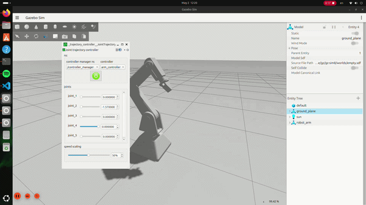
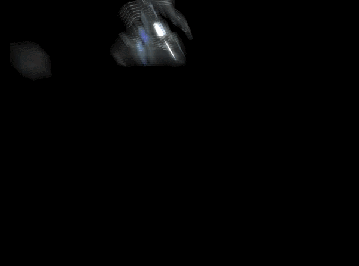

# 🤖 Robotics Portfolio: From CAD Design to Autonomous Control

This repository showcases an integrated engineering pipeline: from mechanical design in **SolidWorks** to advanced simulation and cinematic rendering.

---

## 🏗️ Project 1: Industrial Arm Integration (SolidWorks & ROS 2)
**Focus:** CAD-to-URDF Pipeline, Path Planning, and Autonomous Control.
*Packages: `robot_arm_simulation` & `robot_arm_config`*

---

## 🎨 Project 2: Visual Engineering & Cinematic Animation
**Focus:** High-Fidelity Rendering, Motion Graphics, and Physical Simulation.
*Package: `robot_urdf`*

---
# 📁 Project Modules & Documentation

This repository is organized into three main functional packages. Click on the links below to view the detailed setup and execution steps for each module:

| Module | Description | Link |
| :--- | :--- | :--- |
| **🤖 Robot Simulation** | Core Gazebo simulation environment and ROS 2 Jazzy controllers. | [View README](./robot_arm_simulation/README.md) |
| **🧠 MoveIt Configuration** | Motion planning, Inverse Kinematics, and collision checking setup. | [View README](./robot_arm_config/README.md) |
| **🎨 Robot URDF & Assets** | Custom robot design, STL meshes, and Blender/After Effects animations. | [View README](./robot_urdf/README.md) |

## 🛠️ Global Tech Stack
*   **Mechanical Design:** SolidWorks (STL Export & Assembly)
*   **Robotics Framework:** ROS 2 Jazzy, MoveIt 2, Gazebo
*   **Visualization:** Blender 5.1.1, Adobe After Effects (VFX)
*   **Academic:**

Lead Designer:Bouchareb Mohamed El Fateh (NAKAZAKI)
   
Contributors: Fares Boukelikha, Mohamed El Mehdi
    
 nstitution: USTHB  
